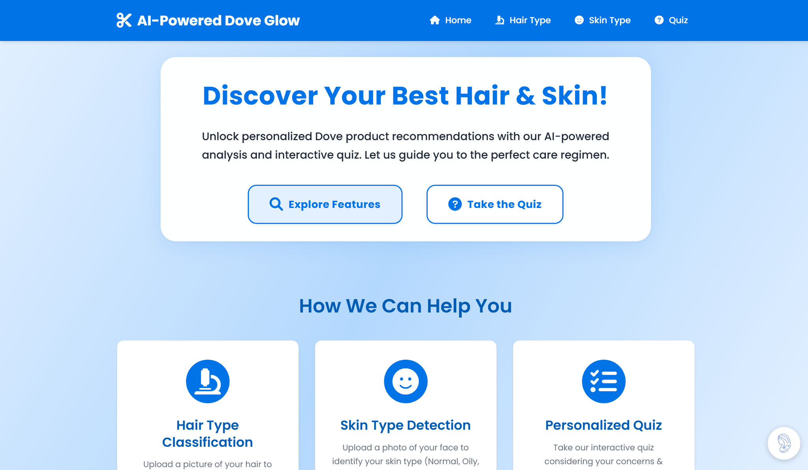

FOR UNILEVER 2025 



[SEE PROJECT DEMONSTRATION](https://drive.google.com/file/d/1jr8YEaT7Km3C2ySwNCnSmFVVLjE6jrqq/view?usp=sharing)

# AI-Powered Dove Glow - Your Personalized Hair & Skin Care Assistant

Welcome to AI-Powered Dove Glow! This Flask-based web application uses smart technology to analyze your hair and skin, guiding you to a personalized Dove care regimen. Discover the perfect Dove products tailored to your unique needs through our interactive quiz, AI-powered analysis, and personalized advice from our AI chatbot assistant.

## Features 

1.  **Hair Type Classification**:
    *   Upload an image of your hair.
    *   Our AI model will identify your hair type (e.g., Curly, Wavy, Straight).
    *   Receive tips for your specific hair type.

2.  **Skin Type Classification**:
    *   Upload a clear image of your face.
    *   Our AI model will determine your skin type (e.g., Oily, Dry, Combination, Normal, Sensitive).
    *   Get insights into caring for your skin type.

3.  **Interactive Quiz for Dove Product Recommendations**:
    *   Take our engaging quiz about your hair and skin concerns, habits, and preferences.
    *   The quiz may include steps to upload images for AI-powered hair and skin type analysis.
    *   Based on your comprehensive answers, we\'ll unveil your unique hair/skin persona and recommend a curated list of Dove shampoos, conditioners, and soaps designed just for you!
    *   Discover your "Dream Strands" and achieve glowing skin with Dove.

4.  **Tita Glow AI Chatbot**:
    *   Chat with our friendly AI assistant "Tita Glow" for personalized hair and skin care advice.
    *   Get detailed information about Dove products best suited for your specific needs.
    *   Ask questions about hair care tips, skin care routines, and Dove product recommendations.
    *   Receive expert advice in a conversational, engaging format with a personal touch.
    *   Access Tita Glow through the chat button available on any page of the application.

## How It Works (Focus on the Quiz)

1.  **Start the Quiz**: Navigate to the "Quiz" section from the homepage or navigation bar.
2.  **Answer Questions**: Progress through a series of questions about your hair (condition, grease, etc.) and skin.
3.  **Upload Images (Optional/Integrated)**: For precise analysis, you might be prompted to upload photos for our AI to determine your hair and skin type.
4.  **Get Your Persona & Recommendations**: Once the quiz is complete, you\'ll be assigned a unique care persona.
5.  **Discover Your Dove Regimen**: Receive personalized recommendations for Dove shampoos, conditioners, and soaps that best suit your profile and persona.
6.  **Chat with Tita Glow**: For more detailed advice, click the chat button to speak with our AI assistant who can provide customized recommendations.

## Project Structure

```
Hair_Detector_Flask/
│
├── app.py                # Main Flask application file
├── gemini_chat.py        # Tita Glow AI chatbot functionality
├── utils.py              # Utility functions (e.g., model loading, image preprocessing)
├── requirements.txt      # Python dependencies
├── static/
│   ├── css/              # Stylesheets (e.g., style.css)
│   ├── js/               # JavaScript files (if any)
│   ├── images/           # Images used in the application
│   └── uploads/          # Folder for user-uploaded images
│
├── templates/            # HTML templates
│   ├── base.html         # Base template with header, navigation, footer
│   ├── index.html        # Homepage
│   ├── hair_type.html    # Hair type classification page
│   ├── skin_type.html    # Skin type classification page
│   ├── quiz.html         # Quiz interface page(s)
│   └── quiz_results.html # Page to display quiz results and Dove recommendations
│
└── models/               # Machine Learning model files
    ├── hair_type_model.h5            # Hair type classification model
    └── skin_type_model.h5            # Skin type classification model
```

## Setup and Installation

1.  **Clone the repository** (if you haven\'t already):
    ```bash
    git clone <repository-url>
    cd Hair_Detector_Flask
    ```

2.  **Create a virtual environment**:
    ```bash
    python -m venv venv
    ```
    Activate it:
    *   Windows: `venv\Scripts\activate`
    *   macOS/Linux: `source venv/bin/activate`

3.  **Install dependencies**:
    ```bash
    pip install -r requirements.txt
    ```

4.  **Run the application**:
    ```bash
    python app.py
    ```
    The application will typically be available at `http://127.0.0.1:5000/`.

## Technology Stack

*   **Backend**: Flask (Python)
*   **Machine Learning**: TensorFlow, Keras
*   **AI Chatbot**: Google Gemini 1.5 Flash API
*   **Frontend**: HTML, CSS, JavaScript

## Discover Your Best Hair and Skin with Dove!

Our goal is to make understanding your hair and skin needs simple and to connect you with the Dove products that will make you look and feel your best. Take the quiz, chat with Tita Glow, and start your journey to healthier hair and skin today!
